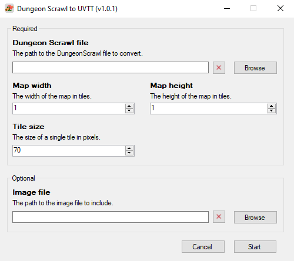
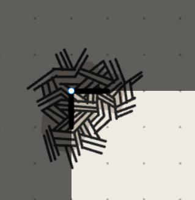

# DungeonScrawl to UVTT

This is a little Windows app to convert a [DungeonScrawl](https://app.dungeonscrawl.com/) file to the more generic and widely supported UVTT (Universal Virtual Table Top) file format. It was primarily created to make importing of DungeonScrawl maps into the OwlBear VTT possible through the Smoke & Spectre extension. It should however work with other VTTs that support the UVTT format as well.

<p align="center">
  
  <br>
  <em>Fig 1: Dungeon Scrawl to UVTT app</em>
</p>

## Table of Contents

- [Installation](#installation)
- [Usage](#usage)
- [Support](#support)
- [License](#license)

## Installation

You don't need to install this application for it to work. Simply download the zip from the latest release on the [DungeonScrawl to UVTT GitHub repo](https://github.com/JWvDronkelaar/dscrawl_to_uvtt_wform/releases/tag/v1.0.1) and extract its contents to a folder of your choice. You can run the application by double-clicking on ```Dungeon Scrawl to UVTT.exe```.


## Usage

There are a few things to keep in mind to make this conversion work. Lets go through them quickly.

### 1 - Drawing

Perform all your drawing on the original dungeon layer you get when opening a new file. While it will likely work with additional or unpacked layers it was never built to support them so keep this in mind. Doors will be recognized and converted when drawn with the door tool only.

 ### 2 - Mark the origin
 
 Before exporting your map to an image, first draw a little corner with the wall tool marking the top left of the area you wish to export. Use snap and make certain the corner point is on a grid intersection. 
 
 ### 3 - Save map and export image
 
 When exporting your map to a `.png` make certain the top left of your exported area matches the corner you've drawn in step 2. This should look like Fig 2. If you omit this step the converter will not be able to set the origin of the map correctly.

<p align="center">
  
  <br>
  <em>Fig 2: Top left export area with mark</em>
</p>

The exported area should encompass full tiles only, no half or quarter tiles. If you change the value of `px per cell` from the default of `70`, make a note of it since you will need it later.

### 4 - Convert to UVVT

Converting the file to UVTT is simple. Open the application and fill out the required fields. The app supports drag and drop which is likely more convenient than browsing for your files.

Once you press start it will convert the DungeonScrawl file and save it in the same folder as the .ds file, with the same name but the dd2vtt extension. This is the file you can import with the Smoke & Spectre extension in the OwlBear VTT.

There are some hidden convenience features but they come with some prerequisites:
- Place both the .ds file and the exported image in the same folder.
- Name them exactly the same but keep the dimensions at the end of the image file.

Once you've done this you can simply drag the .ds file onto the app and it will select the image file and set the map dimensions automatically for you. 

## Support

This tool is written for personal use. I only share it because I feel it could be useful to others but will not provide support.

## License

This project is licensed under the MIT License - see the [LICENSE.md](LICENSE.MD) file for details.
